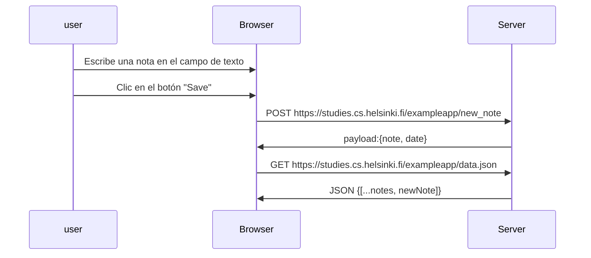
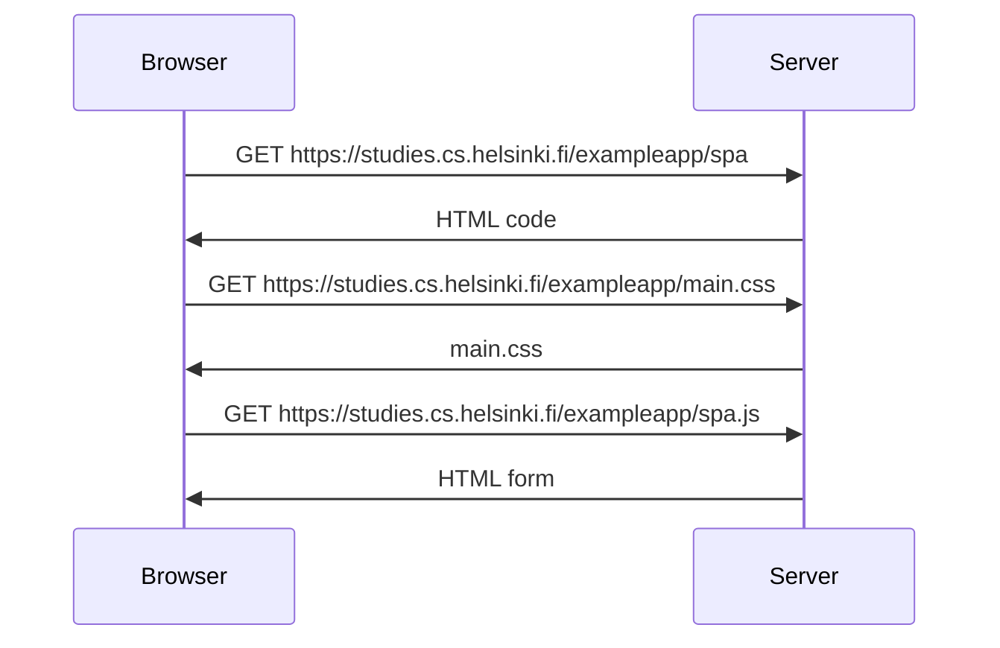
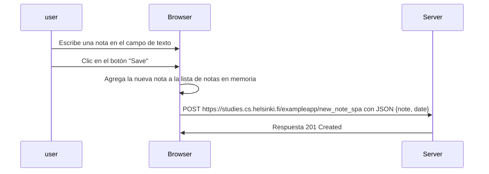

# Diagrama de la solicitud del form

```mermaid
sequenceDiagram
    user->>Browser: Escribe una nota en el campo de texto
    user->>Browser: Clic en el botón "Save"
    Browser->>Server: POST https://studies.cs.helsinki.fi/exampleapp/new_note
    Server->>Browser: payload:{note, date}
    Browser->>Server: GET https://studies.cs.helsinki.fi/exampleapp/data.json
    Server->>Browser: JSON {[...notes, newNote]}
```

# Diagrama de una SPA

```mermaid
sequenceDiagram
    Browser->>Server: GET https://studies.cs.helsinki.fi/exampleapp/spa
    Server->>Browser: HTML code
    Browser->>Server: GET https://studies.cs.helsinki.fi/exampleapp/main.css
    Server->>Browser: main.css
    Browser->>Server: GET https://studies.cs.helsinki.fi/exampleapp/spa.js
    Server->>Browser: HTML form
```

# Diagrama de un formulario de una SPA

```mermaid
sequenceDiagram
    user->>Browser: Escribe una nota en el campo de texto
    user->>Browser: Clic en el botón "Save"
    Browser->>Browser: Agrega la nueva nota a la lista de notas en memoria
    Browser->>Server: POST https://studies.cs.helsinki.fi/exampleapp/new_note_spa con JSON {note, date}
    Server->>Browser: Respuesta 201 Created
```